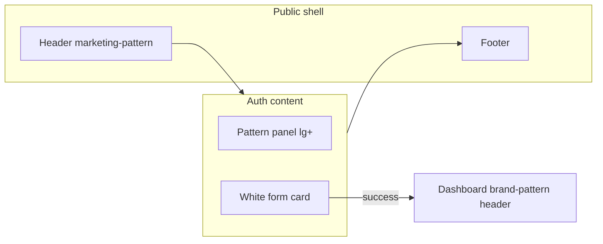

<!-- BEGIN:nextjs-agent-rules -->

# This is NOT the Next.js you know

This version has breaking changes — APIs, conventions, and file structure may all differ from your training data. Read the relevant guide in `node_modules/next/dist/docs/` (resolved from this file's directory; in monorepos the `next` package may not be visible from the repo root) before writing any code. Heed deprecation notices.

This block is written and re-added by `next dev` — verify at `node_modules/next/dist/server/lib/generate-agent-files.js`. Removing it from a diff only re-creates the uncommitted change; committing it with your work keeps the tree clean.

<!-- END:nextjs-agent-rules -->

## Design audit summary

Login and register live in `(auth)` as **standalone full-screen pages** with no shared layout. Marketing and dashboard share a **BPI red / gold / warm stone** system defined in `globals.css`; auth pages use a **separate dark slate + blue** aesthetic that reads like a different product.

| Dimension | Marketing / About | Dashboard | Auth (login / register) |
|-----------|-------------------|-----------|-------------------------|
| **Palette** | `--brand-red`, `--marketing-gold`, light surfaces | Same + `stone-*`, `bg-background` | `slate-950`, `blue-400/500/600` |
| **Header** | `marketing-pattern` + `Header.tsx` | `brand-pattern` sticky nav | Inline logo only |
| **Background** | `marketing-page` + patterned hero bands | `dashboard-page` gradient | Solid dark, blue blur orbs |
| **Radius** | `rounded-sm` / `rounded-md` | `rounded-md` | `rounded-xl` |
| **CTAs** | White or red, uppercase, tracking | `bg-(--brand-red)` | `bg-blue-600` |
| **Eyebrows** | Gold bar + extrabold uppercase | Red uppercase tracking | Blue `tracking-widest` |
| **Forms** | N/A (links only) | Stone borders, red focus ring | Glassy dark inputs, blue focus |
| **Decor** | Rotated gold/red frames | Diagonal `brand-pattern` | Blue gradient blobs |

Auth also **does not use** existing primitives: `marketing-button-*`, `marketing-eyebrow`, `marketing-container`, or dashboard form classes. Shadcn `Button` exists but auth uses raw `<button>` elements.

---

## Redesign direction (recommended)

Treat auth as a **marketing sub-flow**: same chrome as the public site, with a **light form column** that matches dashboard settings/forms so the handoff to `/dashboard` feels continuous.



**Principles**

1. **One brand system** — Replace all blue/slate auth tokens with CSS variables already in `:root`.
2. **Reuse layout** — Add `(auth)/layout.tsx` with `Header` + `Footer` (or a slim auth variant of header without heavy nav).
3. **Extract shared UI** — One auth shell + form field styles aligned with `profileForm.tsx`.
4. **Keep behavior** — No changes to NextAuth, tRPC register, or react-hook-form logic in phase 1.

---

## Target visual spec

### Page shell

- **Root**: `marketing-page` (light warm background), not `bg-slate-950`.
- **Structure** (desktop): two columns inside `marketing-container`, max width consistent with home/about.
  - **Left (lg+, ~45%)**: `marketing-pattern` panel with gold/red frame accents (reuse hero decorative classes from `page.tsx` / `about/page.tsx`).
  - **Right**: centered **form card** — `rounded-md border border-stone-200 bg-white p-6 sm:p-8 shadow-sm` (same family as settings cards).
- **Mobile**: single column — compact patterned **top band** (~120–160px) with logo + one line of copy, then form card below (no full-screen dark mode).

### Typography & copy

- **Eyebrow**: `marketing-eyebrow` or inline gold-bar pattern (`text-(--marketing-red)` / gold bar).
- **H1 (panel)**: match marketing hero scale on large screens only (`text-4xl lg:text-5xl`, tight tracking).
- **H2 (form)**: `text-3xl font-bold tracking-tight text-stone-950` (settings page pattern).
- **Body**: `text-stone-500` / `text-(--marketing-text-muted)`.
- **CTA labels**: align with marketing — e.g. `SIGN IN` / `CREATE ACCOUNT` with `text-xs font-extrabold uppercase tracking-[0.08em]` on primary buttons, or use `.marketing-button-primary` full width.

### Form controls (shared token)

Mirror dashboard inputs from `profileForm.tsx`:

- Labels: `text-sm font-medium text-stone-700`
- Inputs: `rounded-md border border-stone-200 bg-white px-4 py-3 min-h-11`, focus `focus:border-(--brand-red) focus:ring-2 focus:ring-red-100`
- Errors: `text-sm text-(--marketing-error)` or `text-red-600`, consistent placement (`mt-2` under field)
- Links: `text-(--brand-red) hover:text-(--brand-red-dark)` (not `text-blue-400`)
- Primary submit: `rounded-md bg-(--brand-red) hover:bg-(--brand-red-dark) min-h-12 font-bold text-white`
- Secondary / text links: match `Header` LOGIN pill inverse on panel side only

### Branding consistency

- Logo treatment: match dashboard — `rounded-md bg-white object-contain p-0.5` on patterned backgrounds; match marketing header sizing on light areas.
- Wordmark: pick one pattern — e.g. **“BPI” bold + “Bank” normal** (dashboard) everywhere on auth.

### Login vs register content

| Page | Panel headline | Panel bullets | Form title |
|------|----------------|---------------|------------|
| Login | “Welcome back” / finances in one place | Reuse dashboard themes: secure access, transfers, cards (red icon chips on `bg-red-50`) | Sign in |
| Register | “Get started” / smarter money management | Same `benefits` list but gold checkmarks on white panel text | Create your account |

Use **one** side-panel component with props (`eyebrow`, `title`, `subtitle`, `items`) so login/register stay visually identical.

---

## Proposed file structure

```
src/app/(auth)/
  layout.tsx                 # Header + Footer + main wrapper
  login/page.tsx             # thin page: imports AuthShell + LoginForm
  register/page.tsx          # thin page: imports AuthShell + RegisterForm

src/components/auth/
  auth-shell.tsx             # split layout, panel + card slot
  auth-panel.tsx             # patterned left / mobile band
  auth-form-card.tsx         # white card wrapper + title block
  auth-field.tsx             # label + input + error (optional icon slot)
  auth-submit-button.tsx     # primary CTA styling
  login-form.tsx             # move client logic from page
  register-form.tsx          # move client logic from page
  auth-copy.ts               # shared strings / benefits (optional)
```

Optional **`globals.css`** additions:

```css
.auth-page { /* min-height, marketing-page bg */ }
.auth-form-input { /* shared input class if you prefer @apply over duplication */ }
```

Prefer **one source** for input classes: either extend dashboard with a shared `FormField` under `components/ui/` or copy the exact `profileForm` classes into `auth-field.tsx`.

---

## UX and consistency fixes (include in redesign)

1. **Header wayfinding** — User can jump to Home, About, Register from auth (today auth is a dead-end except logo link).
2. **Forgot password** — `/forgot-password` does not exist; either remove the link, disable with “Coming soon”, or add a minimal placeholder page in the same shell.
3. **Register error styling** — Several errors omit `text-red-500` / `mt-2`; unify via `AuthField`.
4. **Terms copy** — Style like settings helper text; link to `/about` or a future terms route.
5. **Loading / disabled states** — Match dashboard (`disabled:opacity-50`, optional spinner pattern).
6. **Accessibility** — `aria-invalid` on errored inputs, `role="alert"` on root errors, focus order aligned with global `:focus-visible` (red outline).
7. **Remove debug** — `console.log` in register `onSubmit` before shipping UI polish.

---

## Implementation phases

### Phase 1 — Visual parity (highest impact, ~1–2 days)

- Add `(auth)/layout.tsx` with marketing `Header` + `Footer`.
- Build `AuthShell` + `AuthPanel` using `marketing-pattern` and decorative frames.
- Restyle both forms with stone/red tokens; delete blue/slate classes.
- Extract shared panel; dedupe mobile/desktop logos.

**Acceptance**: Screenshot comparison — auth sits on same light page as `/about`; primary buttons are red; inputs match settings profile form.

### Phase 2 — Component extraction (~0.5–1 day)

- Split client forms into `components/auth/*`.
- Add `auth-field` / submit button shared with dashboard later if desired.

**Acceptance**: Login and register pages under ~40 lines each; no duplicated layout markup.

### Phase 3 — Polish & edge cases (~0.5 day)

- Handle `callbackUrl` query on login (middleware already sets it in `proxy.ts`) — post-login redirect to intended path.
- Harmonize “Remember me” (wire to NextAuth if supported, or remove if non-functional).
- Footer CTA highlight for current auth page (optional subtle state).

### Phase 4 — Optional enhancements

- **`AuthHeader` variant**: minimal header (logo + LOGIN / Open account only) if full marketing nav feels heavy on login.
- **Shadcn Input + Button** with custom classes via `className` — only if you want one primitive across app; not required if dashboard stays custom inputs.
- **Illustration**: reuse marketing imagery (`block2-digitalization-1.png`) in auth panel for stronger continuity.

---

## Reference mappings (auth class → replace with)

| Current (auth) | Replace with |
|----------------|--------------|
| `bg-slate-950 text-white` (form side) | `marketing-page` + white card |
| `bg-blue-600` submit | `bg-(--brand-red) hover:bg-(--brand-red-dark)` |
| `text-blue-400` links | `text-(--brand-red)` / `dashboard-link` |
| `rounded-xl` inputs/buttons | `rounded-md` |
| `border-white/10 bg-white/4` inputs | `border-stone-200 bg-white` |
| `focus:border-blue-500` | `focus:border-(--brand-red) focus:ring-red-100` |
| Blue blur orbs | Gold/red rotated borders (`border-(--marketing-gold)/90`) |

---

## Success criteria

- Auth pages use **only** brand CSS variables and patterns documented in `globals.css`.
- **Header/Footer** match marketing routes; logo and LOGIN button match `Header.tsx`.
- Form controls are **indistinguishable** from dashboard settings forms at a glance.
- Login → dashboard transition: light auth → light dashboard with **red patterned header** (no jarring dark-to-light jump).
- Single shared auth layout component; login/register differ only in copy and fields.

---

## Suggested order of work

1. `(auth)/layout.tsx` + empty shell on login  
2. `AuthShell` / panel styling against `/about` hero as reference  
3. Login form token swap + test sign-in flow  
4. Register form + error consistency  
5. Extract components + cleanup dead links / console logs  

If you want this implemented next, say whether you prefer the **full marketing Header/Footer** on auth or a **minimal auth header** — that is the main product decision; everything else can follow the spec above.
